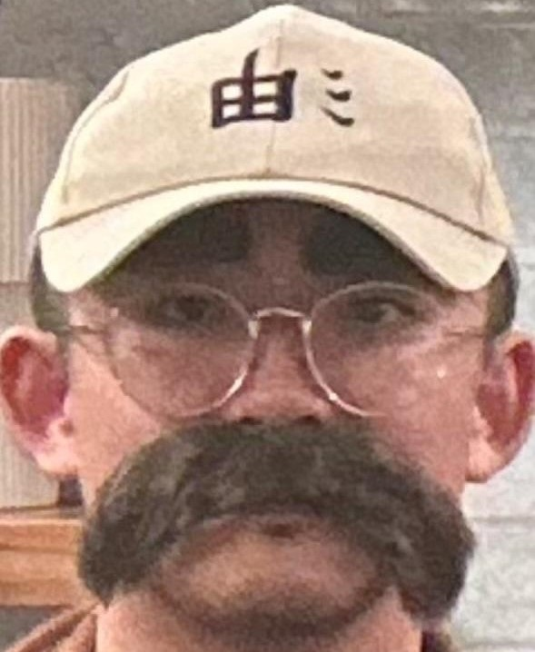
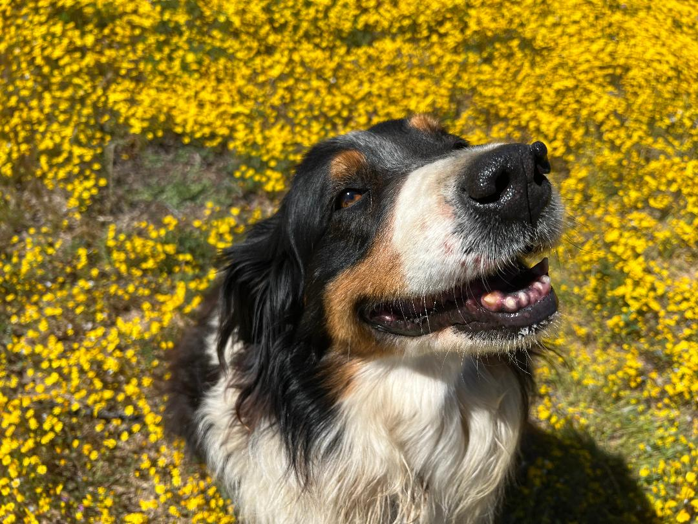

  

    
  

  <h1 style="margin: 0;">Inchul Kim</h1>

I am in my pursuing a B.S. Computer Science at University of California San Diego. 

In my off-time I like to play games with my friends, cook, eat, and listen to R&B.

[Readme.md](README.md)

[Section link to my best friend](#handsome-henny)

quote code ex: `git push`

### Languages
>- C
>- C++
>- Java
>- ( more to come! )

### Todo spring 2025
- [ ] Pass classes
- [ ] Learn guitar
- [ ] Finish BG3

## *Contacts*

  
  
  

## *Handsome Henny*

